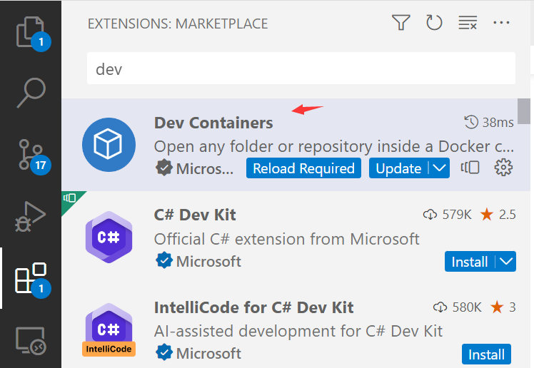
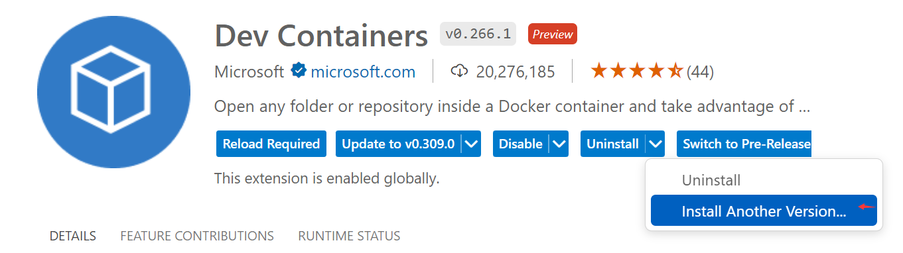
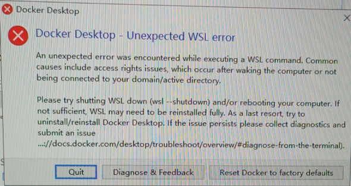
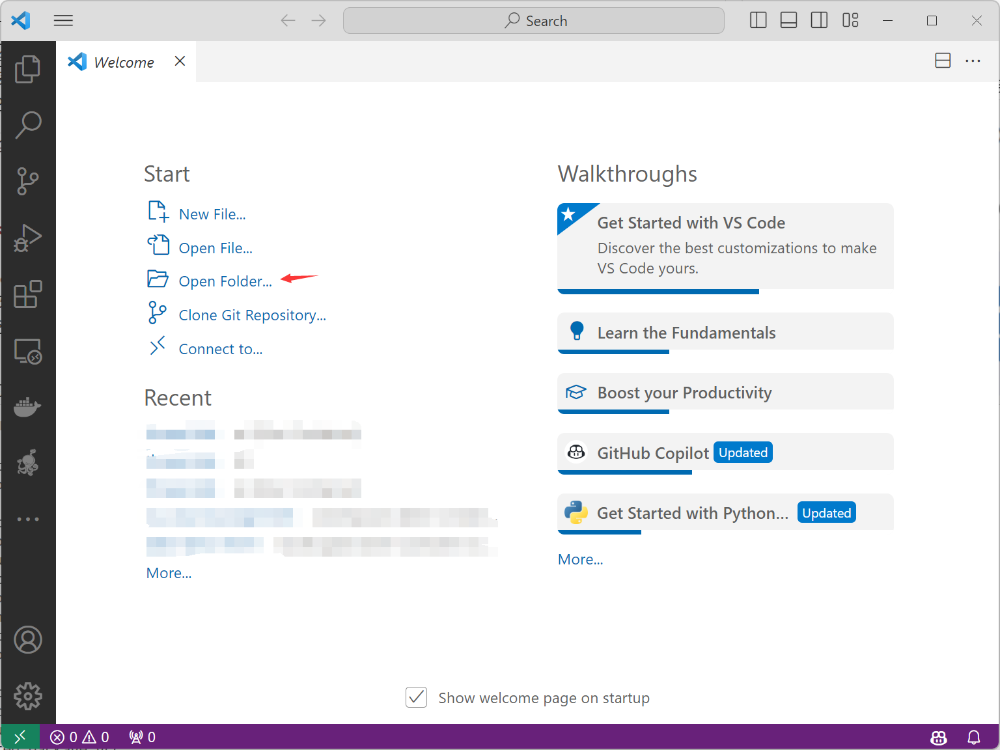
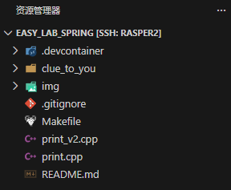
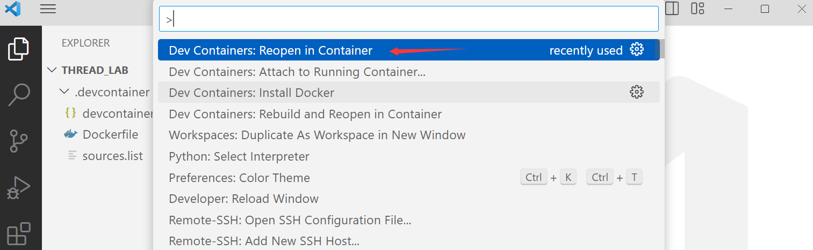

# magic print

- [magic print](#magic-print)
  - [1. 提交截止时间: 2026.3.26 23:59](#1-提交截止时间-2026326-2359)
  - [2. lab内容](#2-lab内容)
    - [2.1. 背景](#21-背景)
    - [2.2. 环境配置](#22-环境配置)
      - [2.2.1. 安装vscode](#221-安装vscode)
      - [2.2.2. 安装dev container插件](#222-安装dev-container插件)
      - [2.2.3. 安装Docker](#223-安装docker)
      - [2.2.4. git clone 本项目](#224-git-clone-本项目)
      - [2.2.5. 使用dev container启动](#225-使用dev-container启动)
    - [2.3. 代码说明](#23-代码说明)
    - [2.4. 任务1](#24-任务1)
    - [2.5. 任务2](#25-任务2)
    - [2.6. 任务3](#26-任务3)
    - [2.7. 测试方法](#27-测试方法)
  - [3. 提交方式、评分规则、deadline](#3-提交方式评分规则deadline)
  - [4. 基础知识引导](#4-基础知识引导)
    - [4.1. 堆内存](#41-堆内存)
    - [4.2. gdb调试](#42-gdb调试)
  - [参考资料](#参考资料)

## 1. 提交截止时间: 2026.3.26 23:59

负责助教 jiajundu@bupt.edu.cn

## 2. lab内容

### 2.1. 背景

`print`在各个语言中都是必不可少的一个函数。例如，在C语言中，`printf`常常被用来输出一些信息或者用来`debug`，在C++中，`cout`承担类似的角色，但是作为一个代码中的`隐藏第六人`，却会影响代码的执行结果，比如，经常会遇到注释或者增加一个`cout`，导致程序执行结果错误或者`segment fault`。这些诡异的bug都是因为对`cout`在内存模型的影响不够了解，我们这个作业就用一个简化后的例子浅探一下`glibc`里`cout`的世界，并且借助本次实验让大家学习使用`gdb`进行调试的方法。

### 2.2. 环境配置

本系列实验为了保证环境的一致性、方便大家实验，我们每个实验都会搭建一个devcontainer作为实验环境。

实验环境的配置分为下面几个部分：
1. x86-64 linux环境
2. gcc,make

因此如果你有linux环境，例如wsl或者云服务器，可以直接在上面进行实验。

对于使用windows的同学仅需要安装docker和vscode devcontainer插件即可。

> github上的code space也可以用，但并没有测试过。

#### 2.2.1. 安装vscode

参考链接：

* [Windows](https://vscode.cdn.azure.cn/stable/1ad8d514439d5077d2b0b7ee64d2ce82a9308e5a/VSCodeUserSetup-x64-1.74.1.exe) 

* [Mac OS](https://vscode.cdn.azure.cn/stable/e8a3071ea4344d9d48ef8a4df2c097372b0c5161/VSCode-darwin-universal.zip)

#### 2.2.2. 安装dev container插件

在vscode插件市场安装devcontainer:


> 如果你在Windows下使用dev container的插件，并且安装了wsl，可能需要手动将插件版本等级降级到v0.266.1
> 
> [参考](https://github.com/microsoft/vscode-remote-release/issues/8172)
> 
> 选择较低版本后，reload window即可。

#### 2.2.3. 安装Docker

* 推荐参考这个链接: [安装docker](https://github.com/BUPT-OS/os_lab/tree/lab2#docker%E5%AE%89%E8%A3%85%E5%8F%8A%E6%8B%89%E5%8F%96%E4%BB%A3%E7%A0%81)
* 也可以在vscode里按ctrl+shift+P,输入`install`,会出现`安装 Docker`的选项

如果安装过程中遇到了下面的问题，可能需要安装一下wsl2，可以参考[链接1](https://blog.csdn.net/qq_43636384/article/details/128453416)和[链接2](https://blog.csdn.net/x777777x/article/details/141092913)。



#### 2.2.4. git clone 本项目

参考[链接](https://git-scm.com/install/windows)在windows上安装git，然后使用下面的命令clone本项目。

> 也可以从Github上下载整个项目的压缩包，但最好是clone，这样有更新就可以拉取到了。

```bash
git clone https://github.com/BUPT-OS/easy_lab.git

# 网络访问有问题的同学也可以clone gitee镜像，两个仓库是同步的：
# git clone https://gitee.com/tobeape6ehok/easy_lab_spring.git
```
#### 2.2.5. 使用dev container启动

使用vscode打开项目文件夹：


打开的时候`.devontainer`要在第一层文件夹：



按ctrl+shift+P或者F1，输入reopen.. 选择下面这个选项即可使用dev container


### 2.3. 代码说明

在lab1的分支中含有`print.cpp`文件，文件中的代码包含一个很奇怪、有趣的现象：我们在23行通过调用`cout`打印了一个字符串，如果我们在程序中注释掉这一行，程序在运行时就会崩溃，如果解开注释，程序就能够执行成功。

你可以参考下面[测试方法](#27-测试方法)一节来验证这个奇怪的现象。

### 2.4. 任务1

很显然，这个奇怪的现象背后肯定有一个bug在作怪。

所以，lab1的第一个任务就是：**在注释掉23行的情况下，找出导致程序崩溃的bug，并且修复它，使得程序可以正常运行**。

> 完成任务1其实只需要更改`print.cpp`中一处即可。

在确定bug已经被成功修复之后，你需要生成git patch，提交到评测平台来验证bug是否已经被修复。关于生成patch的方法，可以参考[链接](https://github.com/rust-real-time-os/os_lab/tree/lab1#%E6%8F%90%E4%BA%A4)。

### 2.5. 任务2

本次lab的本意其实是想让大家理解堆内存的管理方式、以及`cout`对于堆内存的影响，而方式就是通过分析任务1中的bug。

任务2中你需要分析原始的`print.cpp`文件，并且在评测平台上提交一个pdf格式的实验报告，内容包括：

1. 在注释掉23行`cout`后，程序是在执行到哪一行代码才崩溃的? （给出行号）
2. 从堆内存角度，在注释掉23行`cout`后，解释bug产生的原因、以及程序崩溃的原因
3. 从堆内存角度，说明为什么23行`cout`在解开注释的情况下可以使得程序正常运行

由于本次实验涉及的内容比较隐秘，所以我们在本文后半部分添加了[基础知识引导](#4-基础知识引导)章节，旨在帮助大家明确思路并引导正确的思考方向。

> 对于任务2来说，大家注意思考程序的堆上都分配了哪些内存、这些内存之间的位置顺序是怎么样的

### 2.6. 任务3

在任务1和任务2的基础上，我们在`cout`被注释、bug依然存在的情况下，添加一行代码（可以查看`print_v2.cpp`文件）：

```cpp
if(i == 8 || i == 9) continue;
```

可以通过执行`make print_v2`命令编译运行该文件。该任务中你不需要修改代码，只需要回答以下问题：

1. 程序在运行的过程中会有输出吗?
2. 程序可以正常运行吗?
    * 如果可以正常运行，解释为什么在bug依然存在的情况下可以正常运行?
    * 如果不可以正常运行：
        * 程序是在执行到哪一行代码才崩溃的? （给出行号）
        * 解释此时导致程序崩溃的原因又是什么?

同样把对上面问题的回答写在pdf文档里一起提交到评测平台即可。

### 2.7. 测试方法

在lab仓库根目录下，我们提供了一个`Makefile`来编译、运行，在修改`print.cpp`之后，可以通过命令运行`make all`来进行测试，如果执行成功，则会输出`Program execution successful.`，如果执行失败，则会输出`Program execution failed.`。

## 3. 提交方式、评分规则、deadline

提交方式：将patch和pdf文档提交到评测平台（评测平台的链接后续通知，请同学们先做lab）。

评分规则：本lab满分100分，包含patch 10分 (提交patch后成功修复的情况下得到10分)、文档90分。

> 文档评分仅关注答案是否正确。

deadline: 2026.3.26 23:59

## 4. 基础知识引导

### 4.1. 堆内存

在c/c++中，用户程序使用`malloc`或者`new`向glibc中的内存分配器申请堆内存时，内存分配器首先会查看维护的空闲内存块是否可以满足请求，如果可以，则直接分配成功，如果不能满足请求，则内存分配器会首先通过系统调用向内核请求更多内存，然后再完成分配。

为了方便维护堆内存的信息，glibc的内存分配器（以及其他大多数的内存分配器实现）会在用户指定的堆内存大小的基础上多分配一块堆内存，这一块多余的内存区域就用来保存该堆内存的信息（比如块大小等等），被称为元数据（meta-data）。比如用户如果指定需要分配32B，内存分配器在空闲堆内存空间中并不仅仅分配出32B的内存，而是会分配的大小是32+sizeof(meta-data)，前面sizeof(meta-data)的区域用来保存元数据，后面部分以指针的形式返回给用户使用。

除此之外，`cout`在执行过程中也会在堆内存上申请`buffer`来保存需要输出的内容。

为了验证上述机制，我们在`clue_to_you`目录下给出了一些程序，你可以根据运行结果或者自行编写程序来验证自己的想法。

```bash
# Makefile中也提供了clue_b、clue_c、clue_d的命令
make clue_a
```

对于本lab来说，你可以考虑以下问题：
1. 在你的Linux环境中，meta-data的大小是多少?
2. `cout`的`buffer`大小是多少?
3. `cout`的`buffer`在多个`cout`调用间可以复用吗?

关于glibc中其他更多的细节还可以阅读引用[1]，也可以尝试阅读glibc的内存分配器源代码[2] [3]。

### 4.2. gdb调试

gdb是一个功能非常强大的代码调试工具，因为本次lab的关注点在于内存，所以学会使用gdb观测程序的内存状态是非常有用的。

在使用gdb调式前需要重新编译程序，在编译命令中添加`-g`参数使得在最后的二进制文件中包含调试信息。

```bash
# 添加-g参数
g++ a.cpp -g -o a
```

gdb中提供了一个`x`命令可以把触发断点后内存的信息打印出来，比如`x/2g a`的含义就是：获取a指针指向的地址后面的内存，以8个字节为单位，输出前两个，打印的结果就会如下：
```
(gdb) x/2g a
0x5d86e7901ea0: 0x0000000000000000      0x0000000000000031
```

你可以使用该功能来查看meta-data中保存的信息是什么，甚至你还可以打印`cout`的缓冲区内存信息，来查看内容是不是已经打印出来的内容。

对于其他比较常用的gdb指令，可以阅读引用[4]或者gdb的官方文档。

## 参考资料

[1] glibc文档: https://sourceware.org/glibc/wiki/MallocInternals

[2] glibc的_int_free函数：https://elixir.bootlin.com/glibc/glibc-2.31/source/malloc/malloc.c#L4154

[3] glibc的_int_malloc函数：https://elixir.bootlin.com/glibc/glibc-2.31/source/malloc/malloc.c#L3512

[4] gdb cheat sheet: https://darkdust.net/files/GDB%20Cheat%20Sheet.pdf

[5] reddit的相关讨论：https://www.reddit.com/r/C_Programming/comments/p10ol6/printf_before_memory_allocation_fixes_bug_whats/
