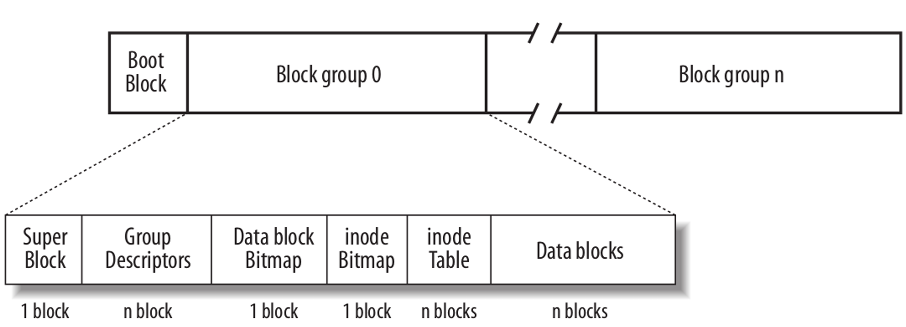
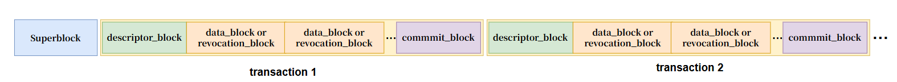

# Ext File System Data Recovery (进阶版)

> **DDL: 2026年6月14日 23:59**

Ext（Extended Filesystem）是 Linux 系统中最主流、最成熟的日志型文件系统。

从发展历程来看，最早的 Ext2（于 1993 年加入 Linux 内核）奠定了 Linux 文件系统的基本框架，包括 Inode、块组（Block Group）等核心概念。然而，Ext2 最大的软肋在于它是一个非日志文件系统，这意味着在系统意外断电或崩溃时，文件系统极易处于不一致状态，重启后必须进行耗时的全盘扫描（fsck）来修复错误，这对于大容量硬盘来说几乎是灾难性的。

为了解决可靠性问题，Ext3 在 2001 年发布。Ext3 最核心的改进是引入了日志（Journaling）机制，在执行真正的元数据修改前，先将操作记录在专门的日志区，即便发生宕机，系统也只需“重放”日志即可在数秒内恢复一致性。不过由于 Ext3 沿用了传统的块映射（Block Mapping）结构，在处理超大文件时效率较低，且不支持超过 16TB 的容量。

Ext4 在 2008 年正式发布，标志着该家族进入了“区段（Extents）”时代。Ext4 彻底抛弃了 Ext3 逐块记录文件的繁琐方式，改用 Extents 记录连续的数据块地址，极大地缩减了大型文件的元数据体积并提升了扫描速度。同时，Ext4 引入了延迟分配（Delayed Allocation）和多块分配（Multiblock Allocation）技术，能够显著减少磁盘碎片并提升写入性能。通过纳秒级时间戳和校验和（Checksum）机制，Ext4 在容量上限（1EB）和数据安全性上都达到了现代数据中心的要求。

Ext 文件系统家族一直遵循着“向下兼容”的开发目标，这种兼容特性使得系统升级轻松且安全，比如可以将 Ext3 和 Ext2 的文件系统挂载为 Ext4 分区，由于某些 Ext4 的新功能可以直接运用在 Ext3 和 Ext2 上，直接挂载即可提升少许性能。

本次 lab 并不涉及到 Ext4 中更加复杂的功能，而是采用 Ext3，主要目的是帮助同学们理解 Ext 系列文件系统数据管理和日志的基础实现，并且可以利用日志机制来恢复被误删的数据。

## 1. Ext3 文件管理方式

对于文件系统来说，存储文件是最基本的功能。Ext3 组织数据的方式仍然延续 Ext2，使用小端字节序存储数据。整个磁盘设备被线性切分成固定大小的数据块，除了第一个数据块作为引导块（boot block）外，剩余的所有块会按组划分称为一个个块组（block group），结构如下：



请阅读参考资料 [1] 学习更加详细的 Ext2 数据管理的方式，Ext3 沿用同样的方式，此处不再赘述。

在阅读过程中，可以结合 `/usr/include/ext2fs/ext2_fs.h` 源文件来查看重要数据结构的定义，同时还可以使用 `AI` 辅助理解结构体内各个字段的含义。

## 2. Journaling Filesystem

修改文件系统的任一系统调用都通常划分为操纵磁盘数据结构的一系列低级操作。如果这些低级操作还没有全部完成系统就意外宕机，就会损坏磁盘数据。为了防止数据损坏，文件系统必须确保每个系统调用以原子的方式进行处理。

Ext3文件系统作为日志文件系统，使用日志机制来保护文件系统免受系统崩溃时数据不一致的影响。Ext3的日志系统操作单位是事务，其核心思想是将一组原子操作打包为一个事务，将事务一次写入日志并且设为提交状态，之后日志一直存留直到所有的块都被更新到磁盘上的实际位置。之所以把一组原子操作打包成一个事务，是为了提高性能。利用这样的日志机制，如果文件系统发生了数据损坏，就可以扫描日志区域，对于没有提交的事务直接丢弃，对于已经提交的事务，重新读取日志修改磁盘数据。

Ext 系列文件系统的日志共有 3 种日志模式可以配置：

* Writeback：只有对文件系统元数据的改变才记入日志，也是最快的模式。数据块直接写入磁盘上的真实位置（fixed location），这种模式不保证日志和数据的写入顺序。回写模式是三种模式中一致性最差的，它只保证文件系统元数据的一致性，不保证数据的一致性。

* Ordered：只有文件系统元数据才写入日志，但是数据会保证在元数据写入到日志前写入真正存储位置。相比于writeback模式，这种模式提供了更高的一致性保护：数据和元数据都保证一致性。

* Journal：文件系统所有数据和元数据的改变都记入日志。这意味着所有数据块会被写2次，一次写入日志，然后再写入磁盘上的真实位置(fixed location)。和ordered一样，data模式提供了相同强度的一致性保护。

本次实验涉及到的日志模式是 Journal。

### 2.1. Ext3 日志数据结构

在对 Ext 日志系统分析之前，首先需要注意日志的所有数据块都是使用大端存储，因此日志数据的字节序和 Ext 文件系统本身的字节序是不同的，分析数据之前应该考虑是否需要字节序转换。

Ext 日志系统的 `inode` 通常为 8，日志数据的整体结构如下图所示，图中的每个小块都是一个数据块：



可以看到日志中的数据块类型有很多，因此 Ext3 在每个块的头部都使用 `struct journal_header_s` 结构体来区分不同类型的数据块，该结构体大小为 12 字节，日志中的每个数据块都会以该结构体作为头部开始（包括日志超级块）。结构体定义如下：

```cpp
typedef struct journal_header_s
{
	__u32		h_magic;		// 魔数: 0xC03B3998
	__u32		h_blocktype;	// 日志块类型：
								// 		JFS_DESCRIPTOR_BLOCK(1): 描述符块
								// 		JFS_COMMIT_BLOCK(2): 提交块
								// 		JFS_SUPERBLOCK_V1(3): 日志超级块v1
								// 		JFS_SUPERBLOCK_V2(4): 日志超级块v2
								// 		JFS_REVOKE_BLOCK(5): 撤销块
	__u32		h_sequence;		// 与此区块对应的事务ID
} journal_header_t;
```

在日志的数据中，首先是日志超级块位于最前面。Ext3 的日志数据同样使用超级块来保存关键数据，包括日志的大小、事务的起始位置等等。与 Ext3 文件系统的超级块相比，日志的超级块要简单得多。结构体定义如下，占用1024B：

```cpp
/*
 * The journal superblock.  All fields are in big-endian byte order.
 */
typedef struct journal_superblock_s
{
/* 0x0000 */
	journal_header_t s_header;

/* 0x000C */
	/* Static information describing the journal */
	__u32	s_blocksize;		/* journal device blocksize */
	__u32	s_maxlen;		/* total blocks in journal file */
	__u32	s_first;		/* first block of log information */

/* 0x0018 */
	/* Dynamic information describing the current state of the log */
	__u32	s_sequence;		/* first commit ID expected in log */
	__u32	s_start;		/* blocknr of start of log */

/* 0x0020 */
	/* Error value, as set by journal_abort(). */
	__s32	s_errno;

/* 0x0024 */
	/* Remaining fields are only valid in a version-2 superblock */
	__u32	s_feature_compat; 	/* compatible feature set */
	__u32	s_feature_incompat; 	/* incompatible feature set */
	__u32	s_feature_ro_compat; 	/* readonly-compatible feature set */
/* 0x0030 */
	__u8	s_uuid[16];		/* 128-bit uuid for journal */

/* 0x0040 */
	__u32	s_nr_users;		/* Nr of filesystems sharing log */

	__u32	s_dynsuper;		/* Blocknr of dynamic superblock copy*/

/* 0x0048 */
	__u32	s_max_transaction;	/* Limit of journal blocks per trans.*/
	__u32	s_max_trans_data;	/* Limit of data blocks per trans. */

/* 0x0050 */
	__u32	s_padding[44];

/* 0x0100 */
	__u8	s_users[16*48];		/* ids of all fs'es sharing the log */
/* 0x0400 */
} journal_superblock_t;
```

日志超级块之后，是由一系列事务组成的列表。每个事务由描述符块、数据块/撤销块、提交块组成。

* 描述符块内是一个日志块标签数组，该标签结构体名为 `struct journal_block_tag_s`，每个标签顺序对应描述符块后面的一个数据块，可以从中读取对应数据块在文件系统中的最终位置，该最终位置即**对应的 Ext3 文件系统中的块号**。对于本实验中使用的文件系统配置，该结构体定义如下面的代码块所示：
	```cpp
	/*
	* The block tag: used to describe a single buffer in the journal
	*/
	typedef struct journal_block_tag_s
	{
		__be32		t_blocknr;		// 对应数据块在磁盘上的最终位置
		__be16		t_checksum;		// 日志 UUID、序列号和数据块的校验和。请注意，仅存储低 16 位
		__be16		t_flags; 		// 与描述符关联的标志，可以是以下各项的任意按位或组合:
									// 		0x1: 磁盘上的数据块已被转义
									// 		0x2: same UUID，表示该块与前一个块具有相同的 UUID，因此省略 UUID 字段
									//		0x4: 数据块已被事务删除
									//		0x8: 该描述符块中的最后一个标签
		char  		uuid[16]; 		// 如果设置了 same UUID 的 t_flags，则此字段不存在
	} journal_block_tag_t;
	```

* 通常情况下，通过日志写入磁盘的数据块会原封不动地写入描述符块之后的数据块中。

* 由于撤销块本次实验不涉及，此处不做介绍。

* 每一个事务末尾存在一个提交块，表明一个事务已完全写入日志，处于提交状态，接下来可以写入磁盘上的最终位置。

基于以上描述，请同学们认真阅读 **Linux 内核文档 [3]**，该文档中对日志数据结构实现做了详细描述，参考资料 **[4]** 中也涵盖了一部分。

### 2.2. 数据恢复

和基础版本实验中的 FAT32 文件系统不同，虽然 Ext3 文件系统在删除文件之后文件内容同样不会被清除，但目录项会被清0、目录项存储的inode序号不复存在，并且该文件的inode内的索引也会被删除。因此，Ext3 文件系统并不能采用相同的方式恢复数据，但是日志的存在提供了数据恢复的另一种手段。

由于文件系统中每个数据块的修改均被记录在日志中，所以根据日志可以找到有关目录块、inode的历史修改记录，从中即可得到文件的数据块索引信息。该手段同样具有一个前提：修改文件的事务日志并没有被覆盖或者清除。

## 3. libext2fs 库

`libext2fs` 是 Linux 下操作 ext2/ext3/ext4 文件系统的底层用户态库，属于 e2fsprogs 工具集的一部分，源代码可以参考[2]。`libext2fs` 为用户程序提供了直接解析与修改 ext 系列文件系统镜像或块设备的能力，能够避免自己手写结构解析出错。

常用的库函数有：

> `libext2fs` 库并没有提供文档，可以借助 `AI` 的能力学习该库。

```cpp
// 用于获取指定 block group 的 inode table 起始块号
// 参数
// 		fs: 文件系统句柄，代表一个已经打开的 ext2/ext3/ext4 文件系统对象
// 		group: block group 编号（0开始）
blk64_t ext2fs_inode_table_loc(ext2_filsys fs, dgrp_t group);
```

```cpp
// 遍历 inode 的所有 block，并对每个 block 执行回调函数
errcode_t ext2fs_block_iterate3(ext2_filsys fs,		// 使用ext2fs_open打开镜像得到的文件系统
				ext2_ino_t ino,						// 需要遍历 block 的 inode 号
				int	flags,							// 遍历控制参数(默认值0，可以使用按位或组合使用):
													// 		BLOCK_FLAG_DATA_ONLY: 只遍历数据块
													// 		BLOCK_FLAG_READ_ONLY: 只读模式
													// 		BLOCK_FLAG_APPEND: append 模式
													// 		BLOCK_FLAG_DEPTH_TRAVERSE: 深度遍历间接块
				char *block_buf,					// block 缓冲区，用于读取 indirect block
				// 每发现一个目录项就会调用一次这个函数
				int (*func)(ext2_filsys fs,			// 使用ext2fs_open打开镜像得到的文件系统
					    blk64_t	*blocknr,			// 当前 block 的 block number 指针
					    e2_blkcnt_t	blockcnt,		// 当前 block 在文件中的逻辑序号
					    blk64_t	ref_blk,			// 如果是direct block，则等于0，如果是indirect block，则等于引用当前block的父block序号
					    int		ref_offset,			// 当前 block 索引在 ref_blk 中的数组偏移位置
					    void	*priv_data),		// 用户可以自定义的数据结构，通过下面的priv_data传入
				void *priv_data);
```

```cpp
// 可以用于读取数据块的内容
errcode_t ext2fs_read_ind_block(ext2_filsys fs,		// 使用ext2fs_open打开镜像得到的文件系统
								blk_t blk,			// 要读取的 block number
								void *buf)			// 用于存储读取到的 block 数据
```

```cpp
// 遍历inode等于dir的目录下的所有entry
extern errcode_t ext2fs_dir_iterate2(ext2_filsys fs,	// 使用ext2fs_open打开镜像得到的文件系统
			      ext2_ino_t dir,						// 需要遍历的目录的inode序号
			      int flags,							// 遍历控制参数(默认值0，可以使用按位或组合使用):
				  										// 		DIRENT_FLAG_INCLUDE_EMPTY: 包含删除的目录项
														// 		DIRENT_FLAG_INCLUDE_REMOVED: 包含已删除项
														// 		DIRENT_FLAG_INCLUDE_CSUM: 包含校验
														// 		DIRENT_FLAG_INCLUDE_INLINE_DATA: 是否遍历存储在inode内部中的目录项
			      char *block_buf,						// 用于存储目录数据块的缓存 buffer
				  // 每发现一个目录项就会调用一次这个函数
			      int (*func)(ext2_ino_t	dir,		// 当前遍历的目录 inode，等于上面的dir参数
					  int	entry,						// 目录项序号（第几个 entry）
					  struct ext2_dir_entry *dirent,	// 当前目录项结构，内部包含目录项的inode序号、文件名等信息
					  int	offset,						// 当前目录项在 block 中的偏移
					  int	blocksize,					// 文件系统 block size
					  char	*buf,						// 当前目录数据块的 buffer
					  void	*priv_data),				// 用户可以自定义的数据结构，通过下面的priv_data传入
			      void *priv_data);
```

## 4. 实验内容

进阶版实验和基础版实验内容相同，也是恢复误删文件内容。请同学们基于对 Ext3 文件系统的理解、利用日志机制来恢复被误删的文件数据。

### 4.1. 环境配置

本系列实验为了保证环境的一致性，使用docker镜像作为实验环境。本lab的代码中提供了`.devcontainer`目录，因此可以在 VScode 中通过 **Dev Containers** 插件创建镜像和容器。

> Dev Containers 插件的使用方法已经在先前实验中介绍，此处不再赘述。

### 4.3. 代码说明

本次实验内容涉及到的代码主要在两个文件：
* `journal.h`：定义日志系统涉及到的重要数据结构
* `recover.cpp`：实现数据恢复的主要逻辑

同学们需要按照大致的代码框架补全恢复逻辑。具体实现可以调用 `libext2fs` 库函数，也可以手写文件系统解析逻辑。

### 4.2. 具体任务

和基础版实验相同，本次实验会为同学们每人制作一份不同的 Ext3 文件系统镜像，请同学们在评测系统的题目描述附件中下载自己学号对应的镜像文件。为了减小实验难度，文件系统镜像的制作方式是：创建镜像、随机写入新文件、写入目标文件、随机写入新文件、删除目标文件。同学们使用实现的代码，从镜像中各自恢复出属于自己的文件内容（文件内部均是UTF-8编码格式的英文字母），然后提交到测试平台即可，后台会自动匹配内容来判断是否通过测试。

从上面的文件系统制作方式可以得到一个比较直观的参考思路：
1. 寻找被删除文件的`inode`所属的数据块序号
2. 从日志中找到该数据块的历史版本，得到`inode`的历史版本
3. 根据`inode`读取原始的文件数据

同学们也可以自行探索其他更好的恢复思路。

### 4.4. 提交

**DDL: 2026年6月14日 23:59**

本Lab6进阶版实验分为两部分评分：

1. 实现部分（70分）：同学们完成实验代码后，恢复各自的文件系统镜像中被删除的文件的内容，以<学号>.txt形式的文件名提交到评测平台，实时给出得分。如果内容匹配，则得分。不需要提交代码。
2. 报告部分（30分）：将实验报告提交到测试平台即可，该部分平台并不能实时给出得分。

## 5. 本地测试

本lab中提供了 `test.sh` 脚本用来帮助同学们本地调试。该脚本可以传递 create 和 recover 两个不同的参数，分别用于创建测试文件系统和编译、测试代码。你可以通过修改该脚本来进行更多的测试。

```bash
# 创建测试文件系统
sudo bash ./test.sh create

# 编译、测试代码
sudo bash ./test.sh recover
```

## 6. 辅助工具

本进阶实验同样可以借助 hexdump 工具分析文件系统镜像。

除此之外，还可以使用 `dumpe2fs` [5] 查看 `ext2/ext3/ext4` 文件系统的元信息，包括 superblock 信息、block group 信息等等。

```bash
dumpe2fs ./ext3.disk
```

## 参考资料

[1] The Ext2 File System: https://pic.0x10.sh/2021/08/The%20Ext2%20File%20System.pdf

[2] e2fsprogs源码: https://github.com/trilioData/e2fsprogs-1.42.12

[3] Journal (jbd2): https://www.kernel.org/doc/html/latest/filesystems/ext4/journal.html

[4] Linux内核学习之Ext文件系统: https://zhuanlan.zhihu.com/p/575915287

[5] dumpe2fs(8) - Linux man page: https://linux.die.net/man/8/dumpe2fs